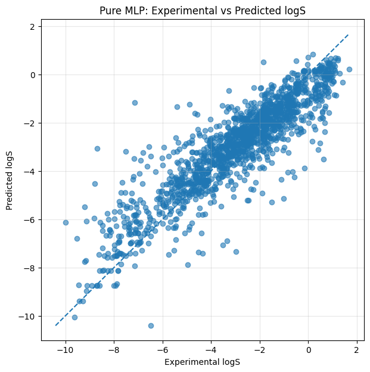
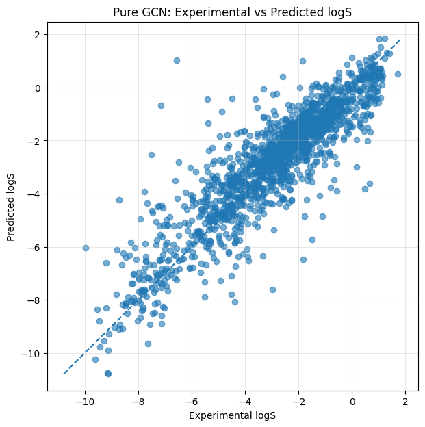

# Molecular Solubility Prediction

A machine learning project for predicting molecular solubility using **Multilayer Perceptron (MLP)** and **Graph Convolutional Network (GCN)** models with PyTorch.

## Models

### MLP

- Input: 14 molecular descriptors calculated with RDKit

- Architecture: Fully connected neural network

### GCN

- Input: Molecular graphs generated from SMILES

- Nodes: Atoms with 18-dimensional feature vectors

- Edges: Chemical bonds

- Architecture: 2-layer GCN with mean + max pooling

## Results

### Prediction vs Experiment





```markdown
| Model |   MSE   |   RMSE  |   MAE   |   R²    |
|:-----:|--------:|--------:|--------:|--------:|
|  MLP  | 1.1515  | 1.0731  | 0.7693  | 0.7890  |
|  GCN  | 1.1781  | 1.0854  | 0.7641  | 0.7841  |
```

The two models achieve comparable predictive performance.

The main advantage of the MLP is its computational efficiency and shorter training time. However, it requires manually selected molecular descriptors as input.

In contrast, the GCN requires only molecular SMILES as input. The molecular graph is constructed directly from the SMILES representation, allowing the model to learn molecular representations from the underlying graph structure without explicitly calculating molecular descriptors. Despite its longer training time, the GCN achieves performance comparable to the descriptor-based MLP.

Overall, the results highlight a trade-off between computational efficiency and representation simplicity: the MLP provides a faster and slightly more accurate approach, while the GCN offers a more direct end-to-end approach from molecular structure to solubility prediction.


## Dataset

- Dataset: AqSolDB

- 9,980 molecules

- Train / Validation / Test: 70% / 15% / 15%

## Technologies

Python · PyTorch · PyTorch Geometric · RDKit · Scikit-learn · Pandas · NumPy · Matplotlib

## Project Structure

```text

├── notebook/
│   ├── mlp_solubility.ipynb
│   └── gcn_solubility.ipynb
├── models/
│   ├── mlp_solubility.pt
│   └── gcn_solubility.pt
├── results/
│   ├── gcn/
│   │   ├── evaluate.txt
│   │   ├── predict_vs_experiment.png
│   │   └── training_curve.png
│   └── mlp/
│       ├── evaluate.txt
│       ├── predict_vs_experiment.png
│       └── training_curve.png
├── data/
│   └── data_curated.csv
├── requirements.txt
└── README.md
```

## Installation

git clone ...

cd molecular-solubility-prediction

pip install -r requirements.txt

## Usage

### MLP

jupyter notebook notebook/mlp_solubility.ipynb

### GCN

jupyter notebook notebook/gcn_solubility.ipynb
